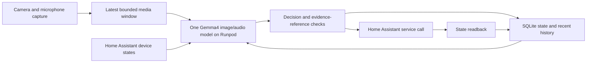

# Home Observer

Continuous physical sensing for a home assistant: local perception of ordinary
objects, an enforced privacy boundary that sends the cloud planner typed
observations only, fast locally approved responses, and local outcome
verification. MIT licensed; see [License and third-party data](#license-and-third-party-data).

## Current iteration: physical sensing

**Production requirement:** visual and audio recordings stay local; the cloud
frontier receives structured observations and local verification results only.
Runpod is permitted for experiments, training and evaluation. The current replay
is experimental; see the [production privacy boundary](docs/production-privacy.md).

The new path separates temporal perception, physical-object tracking, frontier-created watches, and verified execution. Start with the [physical iteration results](PHYSICAL_REPORT.md), [recorded recipe workflow](docs/recipe-workflow.md), [continuous sensing](docs/continuous-sensing.md), [physical model/training](docs/physical-model.md), [real temporal data](docs/temporal-data.md), and [watch/coordinator protocol](docs/watches.md).

### Iteration 2: enforced production path

The privacy boundary is now enforced rather than documented: in-process local
perception on Apple Metal (`physical_local.py`), a typed export boundary with
post-sanitization hashing and export-ID acknowledgement (`production_export.py`),
an exports-only coordinator bridge (`production_coordinator.py`), a structured
local outcome verifier (`local_verifier.py`), and a sandboxed frontier coordinator
(`scripts/frontier_coordinator.py` under `scripts/frontier_sandbox.py`). Run it with
`scripts/run_production.py`. See [production runtime](docs/production-runtime.md),
[local verifier](docs/local-verifier.md), the [frozen continuous benchmark
protocol](docs/continuous-benchmark.md) and the iteration report
[PRODUCTION_REPORT.md](PRODUCTION_REPORT.md), and the plan for making the model
actually work is [docs/model-roadmap.md](docs/model-roadmap.md). The experimental Runpod replay in
`docs/recipe-workflow.md` remains research-only. The node self-describes to agent gateways
through an [Agent Hardware Protocol](https://github.com/scoootscooob/agent-bridge-sdk)
(separate repository) manifest derived from the same schemas (`python -m home_observer.ahp_manifest`).

The earlier baseline's evaluation outputs and hash records are frozen in `baselines/2026-09-15-home-observer`; the adapter weights themselves are not distributed (Gemma Terms of Use), and `checkpoint-manifest.json` records their SHA-256. The sections below retain the original baseline workflow.

## License and third-party data

Code, configuration, documentation and synthetic fixtures are MIT licensed
([LICENSE](LICENSE)). EPIC-KITCHENS-100 (CC BY-NC 4.0), the MS-COCO/Flickr
household photographs, the EgoLife clip and the Gemma-4-E4B-it derivatives are
**not redistributed** here and keep their own terms; the retained labels and
narrations derived from EPIC-KITCHENS remain noncommercial. See [NOTICE.md](NOTICE.md)
and [what is not in this repository](docs/excluded-media.md).

## What is not in this repository

| Omitted | Why | Regenerate with |
|---|---|---|
| EPIC-KITCHENS clips, frames, 480p videos, workflow clips, contact sheets | CC BY-NC 4.0 media | `scripts/temporal_data_prepare.py`, `scripts/continuous_benchmark_prepare.py`, `scripts/cut_workflow_clip.py` |
| COCO/Flickr photographs, EgoLife clip and captures | per-photo licenses, identifiable people | `home_observer.data` preparers |
| LoRA adapters, checkpoints, baseline tarballs | Gemma Terms of Use, size | Runpod jobs in `docs/runpod.md`; hashes in `baselines/*/checkpoint-manifest.json` and the reports |
| SQLite journals, run frames, private bridge directories, sandbox profiles | private local evidence | produced by every run |

Run reports keep their JSON evidence but no frames; `reports/index.html`
thumbnails of excluded media render as unavailable.

## Platform requirements

The library and the test suite run on Linux or macOS with Python 3.11+. The
production-shaped runner needs Apple silicon (PyTorch MPS, Python 3.12) and
macOS `sandbox-exec`; training and vLLM serving need an Ampere-or-newer CUDA
12.8 GPU (`requirements-gpu.txt`, `requirements-vllm.txt`); the sandboxed
frontier coordinator needs an Anthropic-Messages-compatible endpoint reachable
on one local port (`ANTHROPIC_AUTH_TOKEN`, default port 8317). Keys, provider
state and private intermediates live under the gitignored `work/` directory.

## Preserved sensing-plus-action baseline

A single native image/audio model reads camera windows and device telemetry, writes an evidence-linked journal, and proposes Home Assistant actions. Training and learned inference run on Runpod. The first implementation uses **Gemma 4 E4B**, language-only LoRA, bounded observation windows, and explicit persistent memory.

Start with the [measured results dashboard](reports/index.html), [deployment status](reports/release-status.json), and [complete runnable demo](docs/quickstart.md). **No checkpoint is currently accepted for reliable home control.** Training loss, perception accuracy, action accuracy and processing speed are evaluated separately.

## What this implementation establishes

The repository contains executable data preparation, training, authenticated inference, replay evaluation, a durable agent loop, and simulated/real Home Assistant adapters. GPU measurements and training artifacts are recorded by the run scripts. **Passing software tests or synthetic scenarios does not establish reliable whole-house awareness.** Consult the generated run report for the actual measurements and outstanding acceptance criteria.

It does not claim an indefinite recurrent video stream: each request contains a bounded window plus recent state and journal entries. Native image and audio encoders are retained. No detector cascade or external model API is required by the observer.



Evidence-reference checks establish that cited inputs exist. They do not prove
that a model's interpretation of those inputs is correct.

## Setup

```sh
uv venv --python 3.11 .venv
uv pip install --python .venv/bin/python -e '.[dev,data,sensing]'
.venv/bin/python -m pytest -q
```

GPU requirements and exact model revision are in [docs/model.md](docs/model.md) and `requirements-gpu.txt`. Runpod lifecycle and recovery instructions are in [docs/runpod.md](docs/runpod.md). Do not put provider credentials into project files or GPU images; the Runpod key is needed only by the local control-plane process.

## Data and evaluation

See [docs/data.md](docs/data.md) for sources, annotation scope, and licensing metadata. Data groups stay in one split. The datasets have different purposes:

- **Authored synthetic four-camera/audio scenarios:** observable geometry, explicit device rules, held-out families, and counterfactual tests. They test structured decisions and input dependence.
- **COCO household captions:** existing human descriptions teach the summary field only; missing action and no-op labels are masked.
- **EgoLife video/audio:** real raw replay without invented action labels. It supports runtime measurements and qualitative inspection.

Run deterministic plumbing checks (this backend is explicitly not a learned model):

```sh
.venv/bin/python -m home_observer.cli evaluate \
  --backend fixture --data data/fixtures/test.jsonl \
  --policy data/fixtures/policy.json --task-type device_control \
  --output runs/fixture-check
```

Evaluate local files through the private Runpod SSH tunnel. Media uploads are automatic:

```sh
.venv/bin/python -m home_observer.cli evaluate \
  --backend remote --endpoint http://127.0.0.1:8000 --dataset-root data \
  --data data/mixed/test.jsonl --policy data/mixed-v2/policy.json \
  --limit 1 --output work/cloud-window
```

Evaluation writes every prediction before advancing and reports action precision/recall, false-action windows, observation accuracy, invalid outputs, and latency. Public caption-only rows do not become false-positive/silence ground truth. Unknown denominators are `null`, not perfect scores. The runtime benchmark separately measures real processing throughput and backlog.

The consumer configuration serves the pinned base model in BF16 through vLLM. For native GPU comparisons, omit `--adapter` and specify `--quantization none`; experimental weights are retained under `artifacts/training-v1` and `artifacts/training-v2/adapter/checkpoint-*`. Those artifacts are research outputs, not automatically selected releases.

## Agent behavior

1. Validate causal timestamps and media paths.
2. Retrieve prior memory, then record authoritative current device telemetry.
3. Run the native model, requesting one strict JSON decision.
4. Validate entity/service permissions and cited evidence.
5. Persist an action reservation before calling Home Assistant.
6. Verify resulting state; never automatically repeat an ambiguous timed-out action.

Model observations expire into unknown state. Device telemetry takes precedence over conflicting inferred device state. Replayed windows cannot repeat actions after a process restart. Every observation and action retains its original evidence IDs.

Long-term history remains in SQLite. Retrieve earlier events with:

```sh
home-observer search --journal runs/example/journal.sqlite \
  --query keys --before 1750001000
```

The current journal search is literal text search, and device execution is simulated by default. Configure a real Home Assistant adapter explicitly; the included isolated demo is suitable for end-to-end service-call testing.

## Source map

| Module | Responsibility |
|---|---|
| `data.py`, `replay.py` | Data provenance, synthetic scenes, natural-image captions, causal media replay |
| `model.py`, `train.py`, `serve.py`, `vllm_backend.py` | Native multimodal inference, assistant-only LoRA loss, authenticated HTTP API |
| `live.py`, `transport.py` | Independent capture, latest-frame sampling, bounded media retention and cloud uploads |
| `journal.py`, `engine.py` | Persistent state, bounded context, event history, idempotent actions |
| `policy.py`, `ha.py` | Device allowlist, evidence checks, service execution and verification |
| `evaluate.py` | Separate labeled accuracy and runtime measurements |
| `cloud.py` | Live Runpod pricing, deployment, deadlines, verified downloads and cleanup |
| `production_export.py`, `production_coordinator.py` | Typed production export boundary, export store/ACKs/audit, exports-only bridge, fail-closed guards |
| `physical_local.py`, `local_verifier.py` | Local Metal perception backend with strict/judged-fields contracts; structured local outcome verification |
| `scripts/run_production.py`, `scripts/frontier_coordinator.py`, `scripts/frontier_sandbox.py` | Production-shaped workflow runner, sandboxed frontier planner, deny-by-default sandbox wrapper |

## Acceptance criteria

The experimental report must distinguish these independently:

- Training actually updates, saves and reloads adapter weights.
- Held-out model decisions meet the intended action/observation accuracy.
- Four-camera plus audio inference keeps pace with the configured arrival rate.
- Memory remains bounded during the measured soak duration.
- Real Home Assistant demo state changes match model actions.

Fast short runs cannot substitute for a 72-hour stability run, and generated scenes cannot substitute for validation in a real house.

## Contributing and citation

See [CONTRIBUTING.md](CONTRIBUTING.md), [SECURITY.md](SECURITY.md) and
[CITATION.cff](CITATION.cff).
