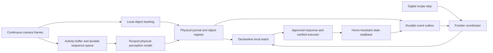

# Continuous physical sensing

## Production requirement

In production, visual and audio recordings stay local. Local perception and
local verification provide structured observations to the cloud frontier, which
plans actions without viewing or retrieving the media. Runpod remains available
for experiments, training and evaluation. See the [production privacy boundary](production-privacy.md).

The diagram and measured implementation below describe the **experiment**. Its
Runpod media uploads and frontier image review do not satisfy the production
privacy requirement.

## Experimental separation of responsibilities

The custom model receives sensory evidence and physical history. Its strict
`PhysicalDecision` schema contains observations, objects, events and uncertainty.
It cannot emit Home Assistant services or actions. The frontier coordinator owns
the digital commitment and chooses an existing approved response through a typed
watch. The executor retains its durable reservation and state-readback behavior.

`phys_*` object IDs and `pevt_*` events live in dedicated tables in the existing
SQLite journal. A bowl needs no registered smart-home entity. Device permission
checks apply to the eventual approved service response, independently of what
objects the observer discovers.

## Capture while inference is busy

`PhysicalStream` runs capture, tracking and learned inference on three independent
threads. A bounded tracking queue keeps a slower tracker from blocking capture. The caller's thread owns the watch database and device executor. Each
captured frame has its source timestamp, capture wall time, sequence ID and JPEG.
Source-to-wall mapping is explicit for real-time file replay.

`ActivityBuffer` keeps pre-roll, activity and post-roll frames. Quiet intervals
produce periodic sequences. Activity scores schedule work; they do not assert
that a pickup, placement or departure happened. The disk spool stores the full
retained sequence plus a manifest identifying the smaller set sent to the model.
The model's frame budget therefore differs from retained input coverage.

Default bounds:

| Resource | Bound / behavior |
|---|---|
| Activity ring | 180 frames; long activity is split with overlap |
| Pending and processing clips | 16 total; excess sequences produce explicit loss records |
| Completed clip media | Latest 16 clips; expired metadata remains |
| Delayed detection replay history | Latest 600 frames |
| Pending frames for tracking | 128; overflow is explicit and capture continues |
| Pending local geometric events | 256; overflow is counted and recorded |
| Geometric event image pairs | Latest 256 event windows; expiry is logged |
| Diagnostic traces | 8 MiB per file, three older rotations |
| In-memory diagnostic tails | 128 records per category |

Structured journal and outbox history persist on disk. These are not an unlimited
media archive. An offline coordinator can receive an event whose image retention
has expired; it must report unavailable evidence instead of claiming verification.

Learned object boxes may arrive after the camera has moved. The runtime looks up
the actual anchor frame and replays retained frames through a separate tracker
before installing the current track state. An expired anchor or failed replay
remains uncertain. It never places an old image box directly on the current frame.

## Tracking and semantic events

The original Lucas–Kanade tracker propagates observed image features, with
forward/backward checks and background translation compensation. See the
[OpenCV optical-flow documentation](https://docs.opencv.org/4.x/d4/dee/tutorial_optical_flow.html).
The CSRT experiment tests a more robust image-box tracker. Its API success flag
does not prove object identity; actual evidence and appearance checks matter.

Local geometric events are `motion_started`, `motion_settled`, and
`visibility_lost`. A stable interval starts at the first stable frame, excluding
the movement before it. These events do not by themselves establish a semantic
pickup, placement, departure or real-world disappearance. Those claims belong to
the learned temporal observer or a frontier review of the physical evidence.

The real-video pilot provides interaction labels, but no dense boxes or identity
ground truth. A manually supplied demonstration box is recorded as a bootstrap,
with its author/provenance and uncertainty. It is never reported as a detection
made by the custom model. Sparse assistant visual adjudication is distinguished
from independent human ground truth.

## Watches and clocks

The frontier coordinator writes a typed `create_watch` command into the file
bridge. The local engine checks the response ID against its locally supplied
approved-response registry. It executes at most one response per immutable watch,
reserving the command durably before calling the executor. Delivery retries and
coordinator acknowledgements use stable IDs and payload hashes.

Track event time, event availability, local arrival, cloud delivery, response
reservation, response sending, response readback and physical-outcome confirmation
are separate clocks. Source times are projected to wall time for watches. A late
learned result does not become timely by backdating its availability. A command
readback establishes actuator state; it does not prove the observer's semantic
interpretation was correct.

The command-line demonstration drains watches for a configured period after
source EOF. It does not synthesize further camera observations or repeat the last
frame. Its report records pending watches and explicitly states that its watch
loop stops when the command returns. A persistent deployment must keep the
capture and watch process running, and give the frontier coordinator an ongoing
delivery worker. A Codex subagent supplies the actual frontier reasoning during
the recorded demonstration; the file bridge does not simulate that reasoning.

## Evaluation scope

Use [physical evaluation](physical-evaluation.md) for event matching, coverage,
tracking labels, uncertainty and delay definitions. The 96-clip EPIC pilot is
participant/recording-disjoint, not verified held-out homes. It contains short,
pretrimmed action clips and incomplete event annotations. Event recall can be
measured against known interactions. False events per hour, full tracking
accuracy and uncertainty calibration require the corresponding annotations;
missing labels must not turn into implicit negative labels.

Input retention and throughput tests establish pipeline behavior under load.
They do not prove semantic recall for unseen household activity. The original
model checkpoints, evaluations and software snapshot are preserved separately in
`baselines/2026-09-15-home-observer`, with independent checkpoint and evaluation
hash manifests.

At startup, an optional eight-frame context clip enters the inference queue while
capture continues. The activity buffer still retains its full overlapping
sequence. This allows early object discovery without waiting for the entire first
activity interval; manifests record the overlapping input coverage explicitly.
