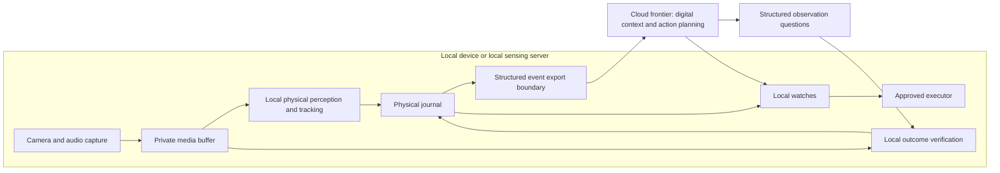

# Production privacy boundary

## Requirement

Production camera images, video, audio and recordings stay on the local device or
local sensing server. The cloud frontier model cannot receive or retrieve them.
Experiments, training and evaluation may continue to use Runpod and the approved
research data. This distinction does not change the preserved experiment results.

This document defines the required production architecture. The Runpod replay
and media-capable coordinator bridge remain experimental implementations. The
production path that enforces this boundary is described in
[production runtime](production-runtime.md): in-process local inference, a typed
export boundary with post-sanitization hashing and acknowledgement, and a
sandboxed frontier coordinator with no media or filesystem access.



## What the frontier can receive

The frontier can reason over deliberately selected semantic information:
object categories and opaque track IDs, observed events, locations, timestamps,
uncertainty, and the result of a local verification. For example:

```json
{
  "event": "object_moved",
  "object_type": "bowl",
  "track_id": "phys_opaque_id",
  "location": "lower_cupboard",
  "pickup_verified": "unknown"
}
```

This is an illustrative production message, not a claim about the experiment's
actual outcome or a replacement for a versioned wire schema. Structured household
observations still reveal information; the export boundary should send only the
fields needed for the user's task.

The frontier can ask, for example, whether the same bowl is now clear of its
support. A local verifier reads local evidence and returns a structured answer
such as confirmed, contradicted or unknown with uncertainty. The frontier does
not inspect the underlying frames. A fast local watch can react while that
verification or cloud reasoning is still pending.

## What cannot cross this boundary

- Images, video, audio, thumbnails, crops, screenshots or encoded media.
- Media URLs, signed download links, local file paths or a tool that resolves an
  evidence handle into media for the cloud coordinator.
- Raw multimodal requests/responses, recording manifests, transcripts, OCR dumps,
  dense visual features or embeddings used as a substitute for sending media.
- Private recordings in telemetry, exception reports, logs, backups or automatic
  training/evaluation uploads.

Opaque evidence IDs can support local audit and local verification. They must
not grant the cloud model access to a camera, recording store or filesystem.
Low confidence never enables an automatic cloud-vision fallback. If local
evidence is insufficient, the answer remains unknown or requires a local user
confirmation.

## Consequences for this prototype

1. **Production perception and verification must execute locally.** A local HTTP
   URL or SSH tunnel into Runpod is still cloud inference and does not satisfy
   the requirement. Runpod remains available for research training/evaluation.
2. **The experimental transport must not be exposed in production.**
   `PhysicalRemoteModel` uploads sensory media. The current coordinator outbox can
   include full perception outputs, image paths and sequence manifests. The
   experimental file bridge also gives a cloud-hosted Codex agent access through
   its tools. Renaming that payload or using text JSON does not make it private.
3. **Production needs a separate enforced export schema and restricted tools.**
   Build outgoing messages from an allowlist of semantic fields; do not forward
   generic journal rows, arbitrary nested model output or raw outbox envelopes.
   Exported payloads need their own stable hashes and acknowledgement contract.
4. **The earlier frontier image review is experiment-only.** In production, the
   local verifier must establish the physical outcome. Cloud planning can use
   its verdict and uncertainty but cannot independently recheck the visuals.
5. **Verify the deployment boundary before claiming compliance.** Exercise success,
   failure, retry, diagnostics and low-confidence paths; inspect actual outbound
   payloads and confirm the cloud coordinator has no media-fetch or filesystem
   capability. Application-level field filtering alone is not a host/network
   isolation guarantee.

The current model's weak temporal performance remains the main capability gap:
the production design cannot depend on a cloud vision model to repair local
perception errors. Local model quality, local outcome verification and target
hardware must be validated together.

## Enforcement status

| Requirement above | Status | Evidence |
|---|---|---|
| Production perception executes locally | Enforced: `assert_production_model` and `ProductionRuntimeConfig` fail closed on remote or experimental backends | `tests/test_production_export.py` |
| Experimental transport not exposed | Enforced: `ProductionCoordinator` publishes exports only; the research `FileCoordinator`/`HTTPCoordinator` are rejected by `assert_production_coordinator` | `tests/test_production_coordinator.py` |
| Separate enforced export schema, stable hashes and ACK contract | Enforced: `ExportEnvelope`, `export_sha256` over sanitized content, `ack_export` by export ID and hash, audit mapping | `tests/test_production_export.py` |
| No image review by the frontier | Enforced: the sandboxed coordinator can read only the bridge and reach only the local proxy port | `tests/test_frontier_sandbox.py` |
| Success, failure, retry, diagnostics and low-confidence paths exercised with actual outbound payloads | Tested with the recorded experimental envelopes and adversarial payloads; the end-to-end synthetic run inspects every frontier-visible file | `tests/test_run_production.py`, `privacy-evidence.json` in each production run |

Remaining limits: the sandbox is a macOS `sandbox-exec` profile on the local
machine, not a hardware or network-level guarantee; structured exports still
reveal household activity by design; and none of this establishes that the
local model's observations are correct.
